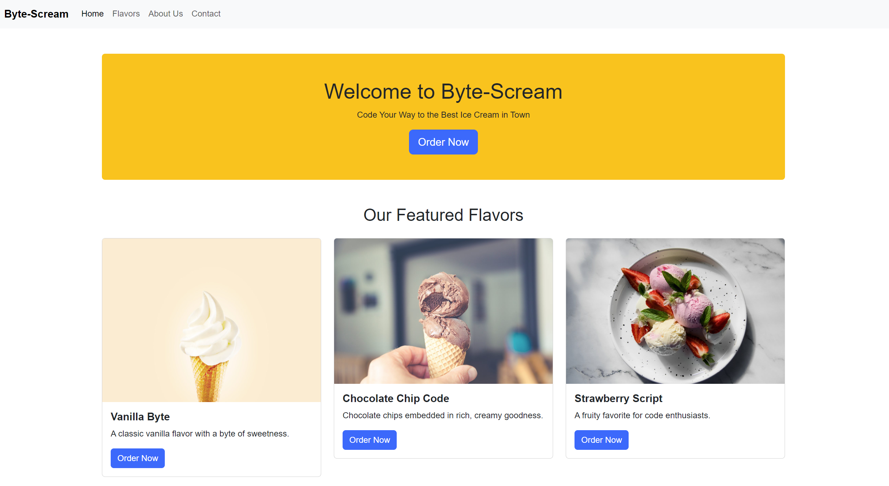

# Building a Landing Page with Bootstrap



## Description 📄
This assignment will guide you in creating a responsive landing page for a code-themed ice cream shop using Bootstrap. You'll learn how to set up your HTML and CSS files, include the necessary Bootstrap components, and build a simple yet professional-looking page step-by-step.

## Expected Project Structure 🏗️

```plaintext
bootstrap_landing_page_project
│   index.html
│   styles.css
```

## Instructions ✅

## 1. **Create the Project Folder and Files**

   - [ ] Create a new HTML file named `index.html`.
   - [ ] Create a new CSS file named `styles.css`.

## 2. **Add HTML Boilerplate**
Now that you have your files set up, start by adding the basic HTML5 boilerplate.

  - [ ] Open your currently empty `index.html` file and add the following code to it.

   ```html
   <!DOCTYPE html>
   <html lang="en">
     <head>
       <meta charset="UTF-8" />
       <meta name="viewport" content="width=device-width, initial-scale=1.0" />
       <title>Byte-Scream Ice Cream Shop</title>
       <link rel="stylesheet" href="styles.css" />
     </head>
     <body>
       <!-- Your content goes here -->
     </body>
   </html>
   ```

**Explanation:**
- Declares the document as HTML5 and sets up the essential metadata and styles.

## 3. **Add Bootstrap CDN:**

- [ ] To include Bootstrap in your project, add the following CDN link to the `<head>` of your `index.html` file:

```html
<link href="https://cdn.jsdelivr.net/npm/bootstrap@5.3.0/dist/css/bootstrap.min.css" rel="stylesheet">
```

Your `<head>` section should now look like this:

   ```html
   <head>
     <meta charset="UTF-8" />
     <meta name="viewport" content="width=device-width, initial-scale=1.0" />
     <title>Byte-Scream Ice Cream Shop</title>
     <link
       href="https://cdn.jsdelivr.net/npm/bootstrap@5.3.0/dist/css/bootstrap.min.css"
       rel="stylesheet"
     />
     <link rel="stylesheet" href="styles.css" />
   </head>
   ```
**Explanation:**

-   The Bootstrap CDN link allows you to use Bootstrap's CSS and components in your project. [Bootstrap CDN Documentation](https://getbootstrap.com/docs/5.3/getting-started/download/)
-   It's important to note that the bootstrap versions being utilized by a CDN can change frequently. Be sure to check the documentation for the latest version being utilized.


## 4. **Add a Navbar**

- [ ] To create a responsive navbar using Bootstrap, add the following code to your `index.html`, between the `<body> </body>` tags:

   ```html
   <nav class="navbar navbar-expand-lg navbar-light bg-light">
     <div class="container-fluid">
       <a class="navbar-brand" href="#">Byte-Scream</a>
       <button
         class="navbar-toggler"
         type="button"
         data-bs-toggle="collapse"
         data-bs-target="#navbarNav"
         aria-controls="navbarNav"
         aria-expanded="false"
         aria-label="Toggle navigation"
       >
         <span class="navbar-toggler-icon"></span>
       </button>
       <div class="collapse navbar-collapse" id="navbarNav">
         <ul class="navbar-nav">
           <li class="nav-item">
             <a class="nav-link active" aria-current="page" href="#">Home</a>
           </li>
           <li class="nav-item">
             <a class="nav-link" href="#">Flavors</a>
           </li>
           <li class="nav-item">
             <a class="nav-link" href="#">About Us</a>
           </li>
           <li class="nav-item">
             <a class="nav-link" href="#">Contact</a>
           </li>
         </ul>
       </div>
     </div>
   </nav>
   ```
**Explanation:**

-   Creates a responsive navigation bar that collapses on smaller screens. [Bootstrap Navbar Documentation](https://getbootstrap.com/docs/5.3/components/navbar/)

## 5. **Add a Hero Section:**

 - [ ] Below the navbar, add a hero section to introduce the shop:

   ```html
   <div class="container mt-5">
     <div class="jumbotron text-center bg-warning text-dark p-5 rounded">
       <h1>Welcome to Byte-Scream</h1>
       <p>Code Your Way to the Best Ice Cream in Town</p>
       <a class="btn btn-primary btn-lg" href="#" role="button">Order Now</a>
     </div>
   </div>
   ```
**Explanation**

- `mt-5`: Adds a top margin of 3rem (48px) to the container, creating space above it to separate the content from the top of the page.
- [Bootstrap Jumbotron Documentation](https://getbootstrap.com/docs/4.0/components/jumbotron/)

## 6. **Add a Flavors Section:**

- [ ] Add a section to display some of the shop's featured flavors:

   ```html
   <div class="container my-5">
     <h2 class="text-center mb-4">Our Featured Flavors</h2>
     <div class="row">
       <div class="col-md-4">
         <div class="card">
           
           <div class="card-body">
             <h5 class="card-title">Vanilla Byte</h5>
             <p class="card-text">A classic vanilla flavor with a byte of sweetness.</p>
             <a href="#" class="btn btn-primary">Order Now</a>
           </div>
         </div>
       </div>
       <div class="col-md-4">
         <div class="card">
           
           <div class="card-body">
             <h5 class="card-title">Chocolate Chip Code</h5>
             <p class="card-text">Chocolate chips embedded in rich, creamy goodness.</p>
             <a href="#" class="btn btn-primary">Order Now</a>
           </div>
         </div>
       </div>
       <div class="col-md-4">
         <div class="card">
           
           <div class="card-body">
             <h5 class="card-title">Strawberry Script</h5>
             <p class="card-text">A fruity favorite for code enthusiasts.</p>
             <a href="#" class="btn btn-primary">Order Now</a>
           </div>
         </div>
       </div>
     </div>
   </div>
   ```
**Explanation**
- Created cards that include an image, title, description and a button.
- [Bootstrap Cards Documentation](https://getbootstrap.com/docs/4.0/components/card/)

## 7. **Add a Footer:**

- [ ] Finally, add a footer to complete the landing page:

   ```html
   <footer class="bg-light text-center py-4">
     <p>&copy; 2024 Byte-Scream Ice Cream Shop. All rights reserved.</p>
   </footer>
   ```
**Explanation**
- [Bootstrap Footer Documentation](https://getbootstrap.com/docs/5.3/examples/footers/)

## 8. **Add Custom Styling**

- [ ] Open `styles.css` and add custom styles to enhance the appearance:

   ```css
   body {
     font-family: Arial, sans-serif;
   }

   .navbar-brand {
     font-weight: bold;
   }

   .jumbotron {
     background-color: #ffc107;
   }

   .card-title {
     font-weight: bold;
   }

   footer {
     background-color: #f8f9fa;
   }
   ```
**Explanation**
- Enhances readability and branding by setting a clean font style across the site.
- Bolds key elements like the navbar brand and card titles to make them stand out.
- Applies consistent styling by adding specific background colors to the jumbotron and footer to create a cohesive visual theme.

## 9. **Testing Your Page:**

- [ ] Open your `index.html` in a browser to view the landing page.
- [ ] Resize the browser window to see how the page adapts to different screen sizes.

## 10. **Commit and Push to Github**
- [ ] Commit and push your work to Github.

# Conclusion 📄

Through this project, you’ve learned to build a responsive landing page using Bootstrap. 

You set up a well-structured project, added key components like the navbar and cards, and customized the design with CSS. 

If you have any questions or need further explanations, feel free to ask the AI for help. 
Here are some examples of what you might ask:

- "How do I use Bootstrap components to create a layout?"
- "How can I customize Bootstrap styles?"

Good luck, and enjoy building your Bootstrap landing page!

##

### Solution codebase 👀
🛑 **Only use this as a reference** 🛑

💾 **Not something to copy and paste** 💾

**Note:**  This lab references a solution file located [here](https://github.com/HackerUSA-CE/aisd-wde-07-building-with-bootstrap/tree/solution) (link not shown).

---
© All rights reserved to ThriveDX
